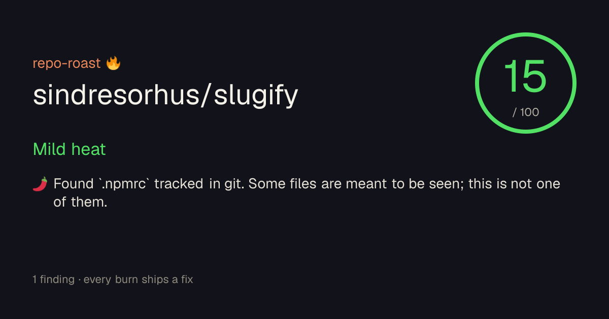

<div align="center">

# repo-roast 🔥

**Roast the security posture of any GitHub profile or repo — deterministic scan, comedic delivery, self-hostable for private repos.**

[](https://github.com/Lonkins/repo-roast/actions/workflows/ci.yml)
[](LICENSE)
[](https://nextjs.org)
[](docs/self-host.md)
[](CONTRIBUTING.md)



</div>

repo-roast finds **real** security problems in a GitHub target — secrets in commit history, dangerous GitHub Actions workflows, vulnerable dependencies, repo-hygiene tells — and delivers them as a **roast**. The security findings are **deterministic** (gitleaks, OSV.dev, the GitHub API; no LLM required). The comedy is a thin layer on top: a bundled template roaster is funny with **zero spend and zero network**, or bring your own LLM key for freeform wit.

It's a funny Trojan horse for a real scanner — and it's self-hostable so you can point it at your **private** repos with your token never leaving your machine.

## Why it's not just another roast toy

Most "roast my GitHub" tools are style jokes over an LLM with no substance and unbounded cost. repo-roast is the opposite:

- **The findings are real and deterministic** — every burn is backed by a scanner rule, evidence, and a location. The LLM (optional) only _phrases_ findings that already exist; it can never invent a vulnerability.
- **Every burn ships a fix.** The joke is the sugar; the fix is the medicine.
- **It punches up at the code, never down at the person.** See [the ethics note](docs/ethics.md). A clean repo gets a grudgingly complimentary roast, not fabricated flaws.
- **Self-hostable for private repos**, token never leaving your instance — the niche nothing else occupies.

## What it checks

| Scanner          | Finds                                                                                                                                              | Detection                                                                     |
| ---------------- | -------------------------------------------------------------------------------------------------------------------------------------------------- | ----------------------------------------------------------------------------- |
| **Secrets**      | committed `.env`, live keys/tokens, and secrets "deleted" but still in git history                                                                 | gitleaks over full history (self-host) or a GitHub API blob-walk (serverless) |
| **Actions**      | `pull_request_target` checking out untrusted code, `write-all` permissions, `${{ github.event.* }}` script injection, unpinned third-party actions | workflow YAML parsing                                                         |
| **Dependencies** | known-vulnerable packages (npm, PyPI, crates.io)                                                                                                   | [OSV.dev](https://osv.dev) advisory API (free)                                |
| **Hygiene**      | `id_rsa`/keystores/`credentials.json`/DB dumps, committed build artifacts, missing `SECURITY.md`, unlicensed public repos                          | repo tree inspection                                                          |

Full details and the fix for each in the **[finding catalog](docs/finding-catalog.md)**.

## Quickstart

```bash
git clone https://github.com/Lonkins/repo-roast.git
cd repo-roast
pnpm install
pnpm dev            # http://localhost:3000
```

Enter a username (`octocat`) or `owner/repo` (`octocat/Spoon-Knife`) and get a shareable roast. No API keys, no LLM, no spend required — the bundled template roaster handles the comedy.

Or hit the JSON API:

```bash
curl "http://localhost:3000/api/roast?target=octocat/Spoon-Knife"
```

## Deploy your own

Two zero-cost paths — Vercel free tier or self-hosted Docker (which bundles gitleaks for full-history secret scanning). Both, plus registering a GitHub OAuth App for private mode and wiring an optional LLM, are in the **[Deploy your own guide](docs/self-host.md)**.

```bash
cp .env.example .env       # optional — public mode works empty
docker compose up --build  # http://localhost:3000
```

## The comedy layer (optional, BYO)

The default **template roaster** is deterministic, funny, and free. For freeform wit, set `ROAST_PROVIDER`:

- `ollama` — local model, zero cost, nothing leaves your machine
- `anthropic` / `openai` — BYO key

The LLM only phrases the real findings; fixes always come from the scanner, and any LLM error degrades gracefully to the template roaster.

## Add a "Roast me" badge

Every result page has a copy-paste snippet. It renders a live burn-score badge:

```markdown
[](https://your-instance/roast/OWNER/REPO)
```

## How it's built

TypeScript · Next.js 16 (App Router) · Tailwind v4 · a pure-TS engine (`src/lib/engine`, `src/lib/scanners`) with no framework imports · Octokit · Auth.js (private mode) · Vitest. Architecture decisions are recorded in [`docs/adr/`](docs/adr/). The engine is fully unit-tested and the app dog-foods gitleaks in its own CI — a scanner that roasts secret leaks had better be immaculate about its own.

## Contributing

Issues and PRs welcome — see [CONTRIBUTING.md](CONTRIBUTING.md). The one hard rule: roast the code, never the coder.

## License

[Apache-2.0](LICENSE)
